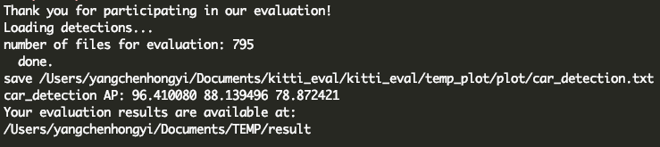
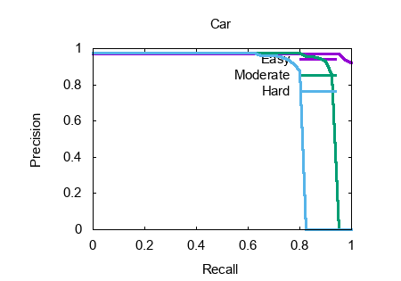
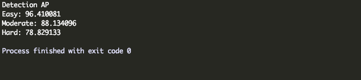
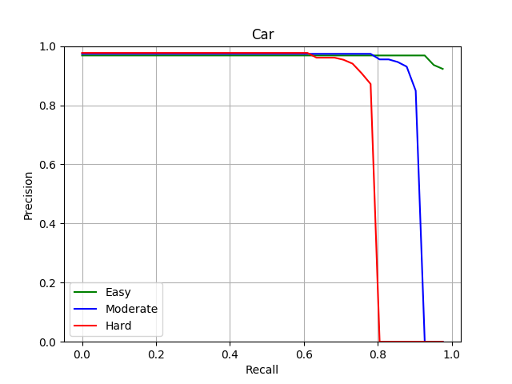

# KITTI_evaluation_for_2d_detection
A python implementation of KITTI evaluation code for 2D detection task. The result may be slightly different from the C++ version (< 0.01). It's slower than the C++ version, but it's easy to use.

C++ Version:

Python Version:

### Requirements:

python3, numpy, matplotlib

### Usage:

Modify the paths in main, then run.

